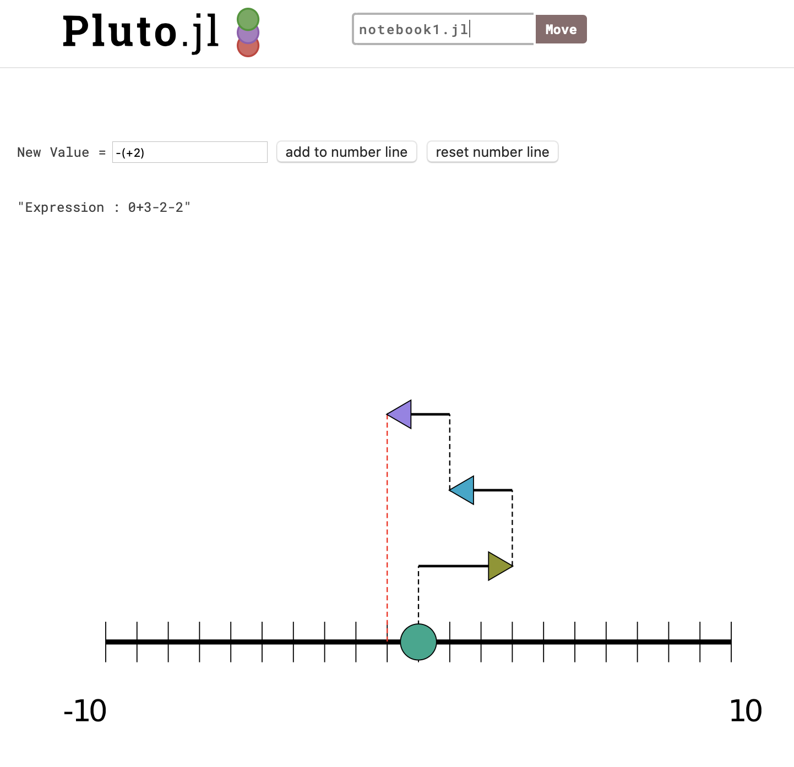
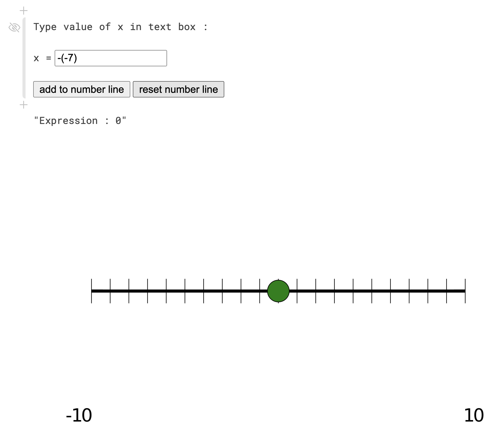

# TheNumberLine

The **Number Line** is a common teaching tool in e.g. K-12 math classes accross the U.S.

_This package is in early development stage when breaking changes are to be expected._

**Authors:** Gael Forget and Jane Chapin

## Instructions

1. Download <https://github.com/gaelforget/TheNumberLine.jl>
2. Open a terminal window & enter `TheNumberLine.jl/` folder
3. Run `julia --project=./ src/run.jl`
4. Proceed as prompted in the terminal

_Tips:_

- the instructions prompted in the terminal will let you use `TheNumberLine` in your web browser as a [Pluto notebook](https://github.com/fonsp/Pluto.jl) called `notebook1.jl`
- you will also need, but only once as a pre-requisite, to download [Julia itself](https://docs.julialang.org/en/v1/) and then add `TheNumberLine` and `Pluto` to your julia environment

## Use Example:

Once you are looking at `notebook1.jl` via `Pluto` in your web-browser, type a number of your choice in the text box and hit `add to number line`. Repeat a few times, e.g. with other numbers, to obtain something like this:

To go back to the starting point, hit `reset the number line` and you should now see:

 

