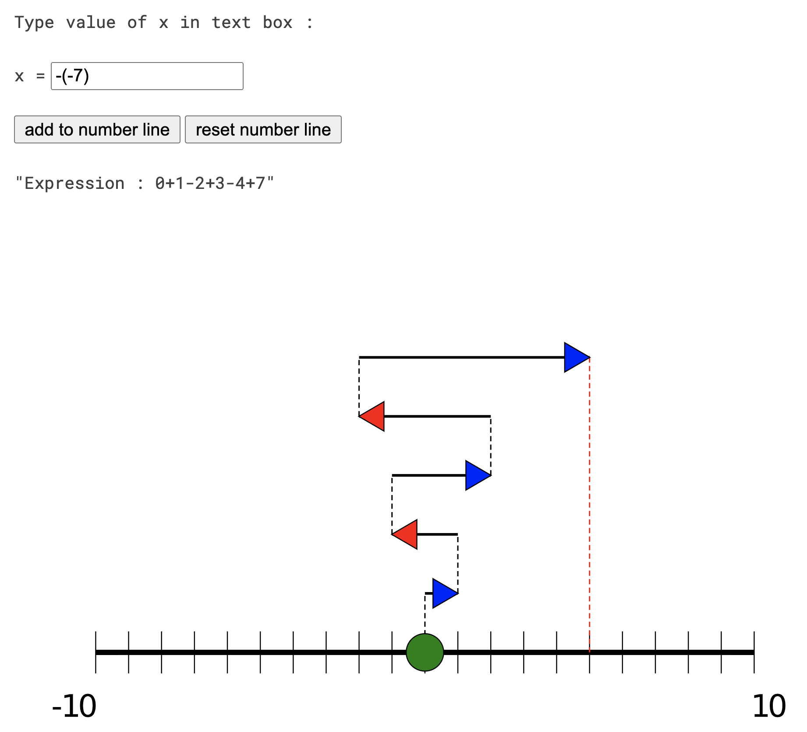
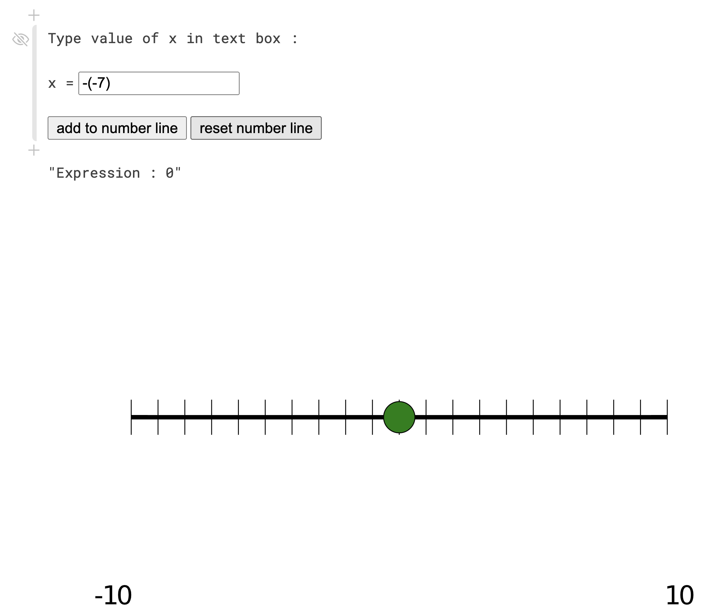

```@meta
CurrentModule = TheNumberLine
```

# TheNumberLine

_This package is in early development stage when breaking changes are to be expected._

```@index
```

**Authors:** Gael Forget and Jane Chapin

## Instructions

In a terminal window, start the `Julia` REPL and, after installing needed packages, execute:

```
using TheNumberLine, Pluto
p=dirname(pathof(TheNumberLine))
cd(p)
Pluto.run()
```

As prompted by `Pluto.run()`, open e.g. `http://localhost:1234` in a web browser. In the newly opened page, type `notebook1.jl` next to `Open from file:`, and hit `open`. 

## Use Example:

In the so-opened `notebook1.jl`, type a number of your choice in the text box and hit `add to number line`. Repeat a few times, e.g. with other numbers, to obtain something like this:

[]()

## Starting Point:

One can always hit `reset the number line` to recover the original state of the number line:

[]() 

```@autodocs
Modules = [TheNumberLine]
```
